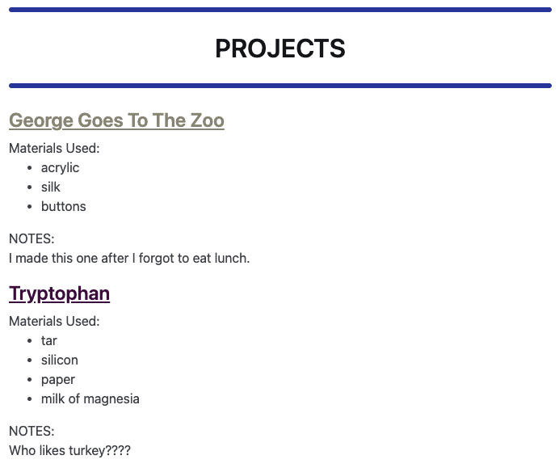
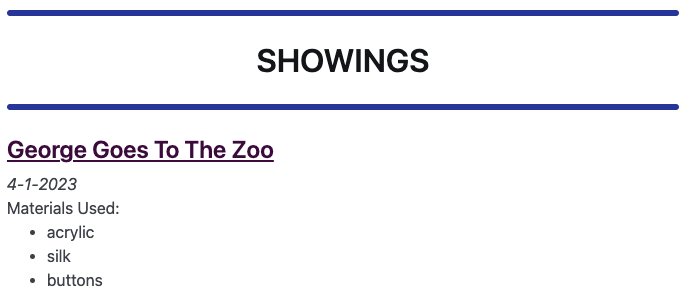

# Look At Me
A light, modular website template built on Python, Jinja and not much else.

I made **Look At Me** because I was having trouble figuring out how to best structure a portfolio website that could showcase projects that fell under multiple categories. For example: I wanted to have a "writing" page and a "data journalism" page, with projects formatted differently on each page. Some projects fell under both categories, but having an entry on each page for the same project didn't seem like the best approach. (Also I didn't want to have to learn and/or install a new language (Jekyll) or work with an external platform (Wordpress) to do it.)

**Look At Me** lets you build a site by filling out some YAML and maybe tweaking some Jinja code if you are feeling spicy.

# Table of Contents
1. <a href="#basics">Basics</a>
2. <a href="#about">About Page</a>
3. <a href="#header">Header</a>
4. <a href="#tagtemplates">Tag Templates</a>
5. <a href="#customization">Customization</a>

<a name="basics"></a>
## Basics
- Define `Parts` in Jinja in `templates/parts.jinja`
- Define `Tags` as collections of `Parts` in `static/tag_templates.yml`
- Add all your `Entries` to `static/entries.yml`, specifying the relevant `Tag` for each `Entry` in the entry's `tag` dictionary

**Look At Me** will automatically generate a page for each `Tag` populated with all each corrosponding `Entry` and its variables.

#### Example:
A `parts.jinja` file:
```

<h2><a href="{{ entry.url }}">{{ entry.title }}</a></h2>



<em>{{ entry.date }}</em><br>



Materials Used:
<ul>

<li>{{ m }}

</ul>



NOTES:
<p>
{{ entry.notes }}
</p>

```

A `tag_templates.yml` file:
```
showings:
  parts:
  - title
  - showdate
  - materials

projects:
  parts:
  - title
  - materials
  - notes
```

Some `entries.yml`:
```
- title: George Goes To The Zoo
  date: 4-1-2023
  notes: I made this one after I forgot to eat lunch.
  materials:
  - acrylic
  - silk
  - buttons
  tags: 
    - showings
    - projects

- title: Tryptophan
  date: 11-2-2022
  notes: Who likes turkey????
  materials:
  - tar
  - silicon
  - paper
  - milk of magnesia
  tags: 
    - projects
```

... and **Look At Me** will automatically generate this page for Projects...
<center></center>

... and this page for Showings...
<center></center>

"George Goes To The Zoo" gets different info and formatting depending the `Tag` page, and "Tryptophan" only shows up on Projects because it isn't tagged for "showings".

<a name="about"></a>
## About
**Look At Me** creates a landing `About` page from information in the `about.yml` file. It also uses information in this file to customize the <a href="#header">`Header`</a>.

It takes the following arguments:

<strong>Title</strong><br>
The title of the website.

<strong>Headline</strong><br>
Text at the top of the website that automatically links to the landing page.

<strong>Email</strong><br>
Appears in italics under social links.

<strong>Image</strong><br>
Image file in `static/images/` that will appear on the landing page.

<strong>Socials</strong><br>
Linked social media icons will appear for any sites provided. (Currently supported: linkedin, github, twitter, email)

<strong>Bio</strong><br>
Appears under the image.

<strong>Include</strong><br>
HTML file in `templates/` that will extend the landing page if specified.

<strong>Footer</strong><br>
Appears in the footer of every page.

<a name="header"></a>
## Header
**Look At Me** automatically generates a `Header` for every page on the site from information provided in `about.yml`. It also generates navigation links to the page for every `Tag`, which appear in the header as well. The order, text and destination for these navigation links can all be customized in the `Tag Templates` file.

<a name="tagtemplates"></a>
## More On Tag Templates
<strong>HTML</strong><br>
As well as the name of defined `Parts`, you can also put html code directly into the `Tag` templates. Theoretically, you don't even need to use `Parts` if your formatting is simple, but `Parts` allows you to construct more complicated Jinja clauses if you want to.

<strong>`sep`</strong><br>
If "True", each entry will be separated with an `<hr>` line.

<strong>`endpoint`</strong><br>
If provided in a `Tag` template, `your.url/endpoint` will load the page for that `Tag`.

<strong>`headline`</strong><br>
Text for section/Page header. Defaults to `Tag`.

<strong>`header-text`</strong><br>
Text for navigation link in header. Defautls to `Tag`.

<strong>`priority`</strong><br>
Sorting order for navigation links in header. Default is alphabetical by `Tag`.

<a name="#customizaton"></a>
## Customization
Nothing here is particularly compliated or intricately connected, so it should be easy to do whatever CSS magic or JavaScript tricks you would like to do. The `static/styles.css` file controls all the styling, and any Jinja macros that are not defined in `parts.jinja` will be in `macros.jinja`, and should be available on any other page. 
